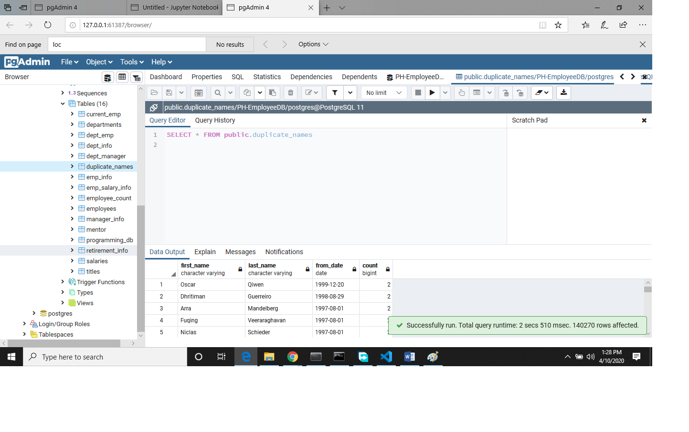
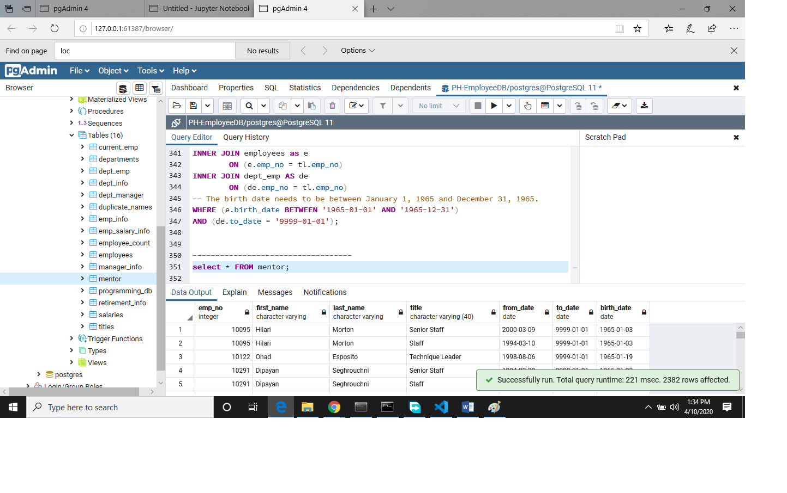

# Pewlett-Hackard-Analysis
An in depth analysis of companies HR

## Introduction 

This project is a walkthrough of an HR process of company where we discover the details 
about companies employees who are currently working, retired, positions and titles, salaries etc

## Module
In the module we discovered the whole companies employees list, we then created new tables about
thier salaries, titles, retirement info and current employees

## Challange

In our challange.sql we 
1. creted a new table for retiring employees as emp_salary_info.csv
2. we found and isolated duplicate names in our database as duplicate_names.csv
3. we found out which employees are ready for mentors in our mentor.csv

### 1. creted a new table for retiring employees as emp_salary_info.csv
Select e.emp_no,
e.first_name, 
e.last_name,
tl.title, 
s.salary, 
s.from_date
INTO emp_salary_info
FROM employees AS e
INNER JOIN titles AS tl
ON (e.emp_no = tl.emp_no)
INNER JOIN salaries AS s
ON (e.emp_no = s.emp_no);

### 2. we found and isolated duplicate names in our database as duplicate_names.csv
140270 duplicate entries with 304966 number of total duplicates

### 3. we found out which employees are ready for mentors in our mentor.csv

SELECT e.emp_no,
 e.first_name,
e.last_name,
tl.title,
 tl.from_date,
 de.to_date,
e.birth_date
INTO mentor
FROM titles as tl
INNER JOIN employees as e
		ON (e.emp_no = tl.emp_no)
INNER JOIN dept_emp AS de
        ON (de.emp_no = tl.emp_no)
-- The birth date needs to be between January 1, 1965 and December 31, 1965.
WHERE (e.birth_date BETWEEN '1965-01-01' AND '1965-12-31')
AND (de.to_date = '9999-01-01');

2382 employees ready for mentors

